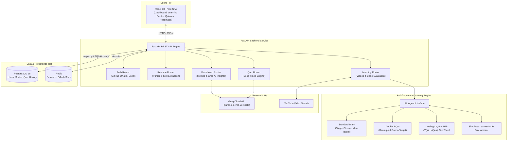

# SkillPath AI

An AI-powered adaptive learning and career guidance platform that analyzes skill gaps, recommends curated curricula, tracks progress, and uses reinforcement learning to personalize learning journeys.

---

## Badges


---

## Table of Contents

1. [Overview](#1-overview)
2. [Problem Statement](#2-problem-statement)
3. [Objectives](#3-objectives)
4. [Key Features](#4-key-features)
5. [System Architecture](#5-system-architecture)
6. [Application Workflow](#6-application-workflow)
7. [Reinforcement Learning](#7-reinforcement-learning)
8. [State Representation](#8-state-representation)
9. [Action Space](#9-action-space)
10. [Reward Function](#10-reward-function)
11. [RL Algorithms](#11-rl-algorithms)
12. [Algorithm Comparison](#12-algorithm-comparison)
13. [Technology Stack](#13-technology-stack)
14. [Project Structure](#14-project-structure)
15. [Installation & Prerequisites](#15-installation--prerequisites)
16. [Clone Repository](#16-clone-repository)
17. [Environment Variables](#17-environment-variables)
18. [Running Locally](#18-running-locally)
19. [Docker Setup](#19-docker-setup)
20. [Usage Guide](#20-usage-guide)
21. [Dashboard](#21-dashboard)
22. [Learning Centre](#22-learning-centre)
23. [Quiz System](#23-quiz-system)
24. [Model Evaluation](#24-model-evaluation)
25. [Evaluation Visualizations](#25-evaluation-visualizations)
26. [Results & Statistical Analysis](#26-results--statistical-analysis)
27. [Research & Experimental Design](#27-research--experimental-design)
28. [Future Improvements](#28-future-improvements)
29. [Limitations](#29-limitations)
30. [Security](#30-security)
31. [Contributors](#31-contributors)
32. [License](#32-license)

---

## 1. Overview

**SkillPath AI** is an intelligent, full-stack educational and career enablement platform designed to optimize how technical skills are acquired and assessed. Traditional learning portals typically offer one-size-fits-all, static course sequences that fail to account for a learner's existing background, immediate gaps, cognitive fatigue, and ongoing test performance.

SkillPath AI bridges this divide by formalizing curriculum navigation as a **Markov Decision Process (MDP)**. The platform analyzes candidate resumes, maps extracted competencies against target industry roles (such as DevOps Engineer, Machine Learning Engineer, Cloud Architect, or Data Engineer), and utilizes **Deep Reinforcement Learning (RL)** to dynamically prescribe the optimal topic and difficulty tier.

The platform provides a complete three-tier architecture featuring a responsive **React 18 single-page frontend (Vite)**, a high-performance **FastAPI asynchronous backend**, persistent **PostgreSQL 18** and **Redis** infrastructure, and three standalone, pure-NumPy reinforcement learning implementations: **Standard DQN**, **Double DQN**, and **Dueling Double DQN with Prioritized Experience Replay (PER)**.

---

## 2. Problem Statement

Aspiring software and machine learning engineers face significant roadblocks in modern career transitions:

1. **Information Asymmetry & Skill Deficits**: Candidates often struggle to pinpoint which specific competencies they lack relative to current job market expectations for target roles.
2. **Static & Rigid Learning Curricula**: Most online course platforms present fixed, linear learning schedules that do not adapt dynamically when a student finds material too trivial or excessively challenging.
3. **Absence of Real-Time Feedback Adaptation**: Traditional recommendation algorithms rarely incorporate dynamic learner fatigue, continuous quiz feedback, or hands-on code performance into real-time difficulty adjustment.
4. **Lack of Prerequisite-Aware Gating**: Learners frequently attempt advanced topics prematurely without mastering foundational dependencies, resulting in frustration and high abandonment rates.

---

## 3. Objectives

The core objectives implemented within SkillPath AI include:

* **Automated Resume Parsing**: Ingest PDF/DOCX resumes, extract technical competencies, and categorize them across technical domains.
* **Target Role Taxonomy & Prerequisite Modeling**: Maintain a structured taxonomy of industry roles, required competencies, and sequential roadmaps with prerequisite dependencies.
* **Skill-Gap Analysis**: Compute quantitative skill deficits by comparing extracted resume proficiencies against role requirements.
* **Reinforcement Learning Recommendation**: Train neural agents to recommend `(topic, difficulty)` actions that maximize mastery gain, align with deficits, and manage fatigue.
* **Curriculum Gating & Video Learning**: Enforce sequential progression through structured modules (`intro`, `core`, `advanced`, `summary`) with video completion gating.
* **Automated Assessment**: Deliver timed 15-question module quizzes with automated scoring, answer explanations, and performance logging.
* **Continuous State Persistence**: Maintain user progress, streaks, hours, and ability ratings across sessions using PostgreSQL 18 and Redis.
* **Controlled Empirical Benchmarking**: Execute fair, multi-seed comparative evaluations across Standard DQN, Double DQN, and Dueling DQN.

---

## 4. Key Features

### Authentication & Session Security
* **GitHub OAuth 2.0 Integration**: Direct asynchronous OAuth token exchange with server-side Redis CSRF state validation (`oauth_state:<state>` with 10-minute TTL).
* **Local Account Fallback**: Secure username and password registration/login options.
* **User Isolation**: Unique session identifiers stored in Redis ensuring isolated user states.

### Resume Processing & Skill Extraction
* **Document Ingestion**: Upload PDF and text resumes stored in secure backend directories.
* **Competency Extraction**: Automated dictionary matching against an extensible technical skills database spanning languages, frameworks, cloud tools, and data systems.

### Career & Target Role Roadmaps
* **Taxonomy Registry**: Pre-configured target profiles including DevOps Engineer, Machine Learning Engineer, Cloud Architect, Data Engineer, and Blockchain Developer.
* **Dependency Roadmaps**: Hierarchical topic roadmaps that unlock advanced modules only when foundational prerequisites are met.

### Adaptive Learning & RL Recommendation Engine
* **MDP Decision-Making**: Action selection driven by deep Q-networks taking current mastery, quiz history, and fatigue as inputs.
* **Explainable Strategy Tags**: Every recommendation is augmented with pedagogical strategies: `gap-filling`, `skill-reinforcement`, `progression`, or `review`.

### Learning Centre
* **Hierarchical Module Structure**: 4-module progression per topic: Module 1 (Fundamentals), Module 2 (Core Concepts), Module 3 (Advanced Architecture), Module 4 (Real-World Integration).
* **Dynamic Video Delivery**: Automated video scraping and curation matched to current topic, module, and difficulty level.
* **Video Progression Gating**: Quizzes remain locked until required video content is completed.
* **Code Sandbox Evaluation**: Built-in code assessment testing syntax, keywords, and structural conventions.

### Quiz System
* **15 Questions per Quiz**: Balanced question sets drawn from easy, medium, and hard difficulty pools.
* **Strict 30-Second Timer**: Automatic question transition upon timer expiration.
* **Dynamic Option Shuffling**: Randomized answer alternatives to eliminate position bias.
* **Comprehensive Review**: Real-time score calculation, percentage display, answer explanations, and badge triggers.

### Dashboard
* **Metrics Tracking**: Visual displays of overall progress, current streak, learning hours, completed projects, and earned badges.
* **AI Learning Insights**: Generative learning diagnostics and topic recommendations powered by the Groq API.
* **Active Learning State**: Quick-resume cards pointing to the latest video and active module.

---

## 5. System Architecture

SkillPath AI is architected as an interconnected microservice system:



---

## 6. Application Workflow

The end-to-end user journey operates through the following sequence:

```text
       1. User Authentication (GitHub OAuth 2.0 or Local Account)
                                  ↓
       2. Resume Upload (PDF/DOCX) & Automated Skill Extraction
                                  ↓
       3. Target Role Selection (e.g., DevOps Engineer, ML Engineer)
                                  ↓
       4. Prerequisite-Aware Skill Gap Analysis & Roadmap Generation
                                  ↓
       5. RL State Construction (Mastery Vector + Recent Scores + Fatigue)
                                  ↓
       6. Greedy Action Recommendation by Trained RL Agent (Topic, Difficulty)
                                  ↓
       7. Learning Centre Access (Module Syllabus, Dynamic Videos, Code Editor)
                                  ↓
       8. Video Completion Tracking & Module Quiz Unlocking
                                  ↓
       9. Timed 15-Question Assessment (30s Timer per Question)
                                  ↓
      10. Performance Evaluation (Score Calculation, Reward Computation)
                                  ↓
      11. State Transition (Mastery Increment, Score Appended, Fatigue Updated)
                                  ↓
      12. Next Adaptive RL Recommendation Prescribed
```

---

## 7. Reinforcement Learning

Reinforcement Learning in SkillPath AI models curriculum recommendation as an agent learning an optimal policy $\pi(a|s)$ to guide a student toward comprehensive technical mastery.

* **Agent**: Deep Q-Network selecting learning actions.
* **Environment**: `SimulatedLearner` (`simulated_learner.py`) capturing non-linear mastery acquisition and session fatigue.
* **Online Network**: Evaluates current state action-values for decision-making.
* **Target Network**: Periodically updated network providing stable target targets for Bellman loss.
* **Experience Replay**: Buffer storing transitions $(s, a, r, s', d)$ to break temporal correlations during gradient descent.
* **Exploration vs Exploitation**: $\epsilon$-greedy exploration annealed exponentially from $\epsilon=1.0$ down to $\epsilon_{\text{min}}=0.05$ during training; greedy action selection ($\epsilon=0.0$) during production evaluation.

---

## 8. State Representation

The state vector $s \in \mathbb{R}^{13}$ is normalized in the range $[0.0, 1.0]$:

| Index | Feature Description | Range | Operational Meaning |
| :---: | :--- | :---: | :--- |
| **0** | Python Mastery | $[0.0, 1.0]$ | Estimated proficiency in Python programming |
| **1** | Machine Learning Mastery | $[0.0, 1.0]$ | Estimated proficiency in classical ML |
| **2** | Deep Learning Mastery | $[0.0, 1.0]$ | Estimated proficiency in neural networks |
| **3** | Statistics Mastery | $[0.0, 1.0]$ | Estimated proficiency in probability & statistics |
| **4** | NLP Mastery | $[0.0, 1.0]$ | Estimated proficiency in natural language processing |
| **5** | Computer Vision Mastery | $[0.0, 1.0]$ | Estimated proficiency in vision & image processing |
| **6** | MLOps Mastery | $[0.0, 1.0]$ | Estimated proficiency in ML deployment & pipelines |
| **7** | Data Engineering Mastery | $[0.0, 1.0]$ | Estimated proficiency in ETL, databases & data tools |
| **8** | DevOps Mastery | $[0.0, 1.0]$ | Estimated proficiency in containers, CI/CD & infrastructure |
| **9** | Recent Quiz Score $t-2$ | $[0.0, 1.0]$ | Normalized score from two quizzes prior (zero-padded) |
| **10** | Recent Quiz Score $t-1$ | $[0.0, 1.0]$ | Normalized score from previous quiz (zero-padded) |
| **11** | Recent Quiz Score $t$ | $[0.0, 1.0]$ | Normalized score from most recent quiz (zero-padded) |
| **12** | Session Fatigue | $[0.0, 1.0]$ | Cumulative fatigue signal calculated as $\min(1.0, \text{step} / 12)$ |

---

## 9. Action Space

The action space consists of **27 discrete actions** defined as the Cartesian product of 9 curriculum topics and 3 difficulty tiers:

$$\mathcal{A} = \{0, 1, 2, \dots, 26\}$$
$$\text{action} = \text{topic\_index} \times 3 + \text{difficulty\_index}$$

* **Topics (9)**: Python, Machine Learning, Deep Learning, Statistics, NLP, Computer Vision, MLOps, Data Engineering, DevOps.
* **Difficulty Tiers (3)**:
  * `0`: **Beginner** (target skill mastery level $\approx 0.20$)
  * `1`: **Intermediate** (target skill mastery level $\approx 0.50$)
  * `2`: **Advanced** (target skill mastery level $\approx 0.85$)

---

## 10. Reward Function

The reward function mathematically balances four pedagogical dimensions:

$$R(s, a) = 0.40 \cdot \text{perf} + 0.30 \cdot \Delta \text{mastery} + 0.20 \cdot \text{alignment} - 0.10 \cdot \text{fatigue}$$

Where:
* **$\text{perf} = (\text{quiz\_score} + \text{code\_score}) / 200.0 \in [0.0, 1.0]$**: Reflects test and coding performance.
* **$\Delta \text{mastery} \in [0.0, 1.0]$**: Incremental mastery gained on the recommended topic during the step.
* **$\text{alignment} = 1.0 - \text{mastery}(\text{topic}) \in [0.0, 1.0]$**: Encourages closing existing skill deficits rather than re-practicing already mastered subjects.
* **$\text{fatigue} \in [0.0, 1.0]$**: Penalty proportional to study session length.
* The scalar output is clipped to $[-1.0, 1.0]$.

---

## 11. RL Algorithms

### 1. Standard DQN (`DQN/backend/dqn_agent.py`)
* **Trunk Architecture**: Fully connected MLP ($13 \to 64 \to 64 \to 27$) with ReLU activations.
* **Output**: Direct single-stream vector of 27 Q-values.
* **Bellman Optimality Target**:
  $$y = r + \gamma (1 - d) \max_{a'} Q_{\text{target}}(s', a')$$
* **Replay Buffer**: Uniform random sampling across $N=10,000$ stored transitions.

### 2. Double DQN (`Double_DQN/backend/dqn_agent.py`)
* **Decoupled Target Calculation**: Addresses the maximization bias of standard Q-learning by using the online network to select the optimal action and the target network to evaluate its value:
  $$a^* = \operatorname{argmax}_{a'} Q_{\text{online}}(s', a')$$
  $$y = r + \gamma (1 - d) Q_{\text{target}}(s', a^*)$$
* **Buffer**: Uniform experience replay buffer ($N=10,000$).

### 3. Dueling Double DQN with PER (`Dueling_DQN/backend/dqn_agent.py`)
* **Dueling Architecture**: Splits the feature trunk ($64 \to 64$) into two separate streams:
  * State-Value Stream: $V(s) \in \mathbb{R}^1$
  * Action-Advantage Stream: $A(s, a) \in \mathbb{R}^{27}$
  * Identifiable Aggregation Layer:
    $$Q(s, a) = V(s) + \left( A(s, a) - \frac{1}{|\mathcal{A}|} \sum_{a'} A(s, a') \right)$$
* **Target Decoupling**: Utilizes Double DQN target evaluation.
* **Prioritized Experience Replay (PER)**:
  * Binary SumTree structure offering $\mathcal{O}(\log N)$ sampling and priority updates.
  * Priority formula: $p_i = (|\delta_i| + \epsilon)^{\alpha}$ where $\alpha = 0.6$.
  * Importance-sampling correction: $w_i = (N \cdot P(i))^{-\beta} / \max_j w_j$ with $\beta$ annealed from $0.4 \to 1.0$.

---

## 12. Algorithm Comparison

| Feature | Standard DQN | Double DQN | Dueling DQN |
| :--- | :---: | :---: | :---: |
| **Network Architecture** | Single-Stream MLP | Single-Stream MLP | Dual-Stream Dueling ($V$ and $A$) |
| **Value Stream $V(s)$** | No | No | **Yes** ($\mathbb{R}^1$) |
| **Advantage Stream $A(s, a)$** | No | No | **Yes** ($\mathbb{R}^{27}$) |
| **Target Formulation** | $\max_{a'} Q_{\text{target}}(s', a')$ | $Q_{\text{target}}(s', \operatorname{argmax} Q_{\text{online}})$ | $Q_{\text{target}}(s', \operatorname{argmax} Q_{\text{online}})$ |
| **Decoupled Evaluation** | No | **Yes** | **Yes** |
| **Replay Mechanism** | Uniform Random | Uniform Random | **Prioritized Experience Replay (SumTree)** |
| **Importance Sampling** | No | No | **Yes** ($\beta = 0.4 \to 1.0$) |
| **Target Network Updates** | Hard Copy (25 steps) | Hard Copy (25 steps) | Hard Copy (25 steps) |
| **Exploration Policy** | $\epsilon$-greedy ($1.0 \to 0.05$) | $\epsilon$-greedy ($1.0 \to 0.05$) | $\epsilon$-greedy ($1.0 \to 0.05$) |

---

## 13. Technology Stack

### Frontend
* **React 18.2.0**: Declarative UI rendering
* **Vite 5.1.6**: High-speed build tool and dev server
* **React Router DOM 6.22.3**: Client-side routing (`/dashboard`, `/learning`, `/quiz`, `/gap`)
* **Lucide React 1.16.0**: Modern UI iconography
* **Vanilla CSS**: Responsive glassmorphic interface

### Backend
* **FastAPI**: Modern, high-performance asynchronous Python web framework
* **Uvicorn**: ASGI web server
* **Pydantic**: Data validation and request schemas
* **SQLAlchemy 2.0 (asyncio)**: Object-relational mapping
* **AsyncPG**: Asynchronous PostgreSQL database driver
* **AioRedis / Redis-py**: Asynchronous Redis interface
* **Authlib & HTTPX**: OAuth 2.0 and async HTTP communication

### Database & Caching
* **PostgreSQL 18**: Relational persistence (users, user states, quiz history, activities)
* **Redis**: In-memory caching, CSRF OAuth tokens, session management

### AI / Reinforcement Learning
* **NumPy**: Pure NumPy implementations of neural layers, backpropagation, and SumTree
* **SciPy**: Statistical evaluation and hypothesis testing (Welch's t-test, confidence intervals)
* **Pandas**: Evaluation dataset manipulation and CSV logging
* **Matplotlib**: High-resolution chart rendering
* **PyPDF2 / PDFPlumber**: Document text extraction for resumes

### External APIs
* **Groq Cloud API (`llama-3.3-70b-versatile`)**: Personalized learning insights and quiz generation
* **YouTube Search Python**: Dynamic module video discovery

---

## 14. Project Structure

```text
Skillpath_Ai/Updated/
├── DQN/                                    # Standard DQN Service Directory
│   ├── backend/                            # FastAPI API Service
│   │   ├── dqn_agent.py                    # Standard DQN Agent & Uniform Replay
│   │   ├── environment.py                  # MDP State/Action/Reward specifications
│   │   ├── simulated_learner.py            # Simulated Learner Environment
│   │   ├── recommender.py                  # Recommendation generation logic
│   │   ├── roles_config.py                 # Target roles taxonomy and syllabus
│   │   ├── database.py                     # PostgreSQL Async Session
│   │   ├── models.py                       # SQLAlchemy models
│   │   ├── routers/                        # Endpoints: auth, dashboard, learning, quiz, resume
│   │   ├── test_standard_dqn.py            # Unit tests for Standard DQN
│   │   └── dqn_weights.pkl                 # Trained DQN weight matrices
│   ├── frontend/                           # React + Vite Client
│   │   ├── src/pages/                      # Dashboard, QuizView, LearningView, SkillGap, etc.
│   │   └── package.json
│   ├── docker-compose.yml                  # 4-container stack (port 8000 / 8501)
│   └── .gitignore
│
├── Double_DQN/                             # Double DQN Service Directory
│   ├── backend/                            # FastAPI API Service (port 8001)
│   │   ├── dqn_agent.py                    # Double DQN decoupled target logic
│   │   └── test_double_dqn.py              # Unit tests for Double DQN
│   ├── frontend/                           # React Client (port 8502)
│   ├── docker-compose.yml
│   └── .gitignore
│
├── Dueling_DQN/                            # Dueling Double DQN Service Directory
│   ├── backend/                            # FastAPI API Service (port 8002)
│   │   ├── dqn_agent.py                    # Dueling architecture + SumTree PER
│   │   └── test_dueling_double_dqn.py      # Unit tests for Dueling DQN
│   ├── frontend/                           # React Client (port 8503)
│   ├── docker-compose.yml
│   └── .gitignore
│
├── AI-Learning-Journey-Resume-Analyzer/    # Resume skill extraction standalone service
│   ├── backend/
│   ├── frontend/
│   └── .gitignore
│
├── evaluation/                             # Scientific RL Evaluation & Benchmarking Suite
│   ├── run_evaluation.py                   # Automated benchmark runner
│   ├── config.json                         # Reproducibility metadata & test outputs
│   ├── results/                            # CSV Datasets
│   │   ├── combined_results.csv            # All 3,000 evaluation episodes
│   │   ├── dqn_results.csv                 # Raw Standard DQN episodes
│   │   ├── double_dqn_results.csv          # Raw Double DQN episodes
│   │   ├── dueling_dqn_results.csv         # Raw Dueling DQN episodes
│   │   └── summary_metrics.csv             # 24-metric comparative summary table
│   ├── graphs/                             # 25 High-Resolution PNG Visualizations
│   │   ├── average_episode_reward.png
│   │   ├── cumulative_reward.png
│   │   ├── training_curves_comparison.png
│   │   └── ... (22 additional individual metric plots)
│   ├── report/
│   │   └── rl_comparison_report.md         # Full 22-section markdown evaluation report
│   └── .gitignore
│
├── .gitignore                              # Monorepo root gitignore
└── README.md                               # Project documentation
```

---

## 15. Installation & Prerequisites

### Prerequisites
* **Python**: Version `3.10` or higher
* **Node.js**: Version `18.0` or higher (with `npm`)
* **Docker & Docker Compose**: (Required for containerized deployment)
* **PostgreSQL**: Version `18` (if running locally without Docker)
* **Redis**: Version `7+` (if running locally without Docker)

---

## 16. Clone Repository

```bash
git clone <YOUR_REPOSITORY_URL>
cd Skillpath_Ai/Updated
```

---

## 17. Environment Variables

Create a `.env` file in the root of the targeted service directory (e.g., `DQN/.env`, `Double_DQN/.env`, or `Dueling_DQN/.env`):

| Variable | Description | Required | Default / Example |
| :--- | :--- | :---: | :--- |
| `DATABASE_URL` | PostgreSQL async connection URI | **Yes** | `postgresql+asyncpg://postgres:postgres@db:5432/skillpath` |
| `REDIS_URL` | Redis connection URI | **Yes** | `redis://redis:6379/0` |
| `GITHUB_CLIENT_ID` | GitHub OAuth application client ID | Optional | `YOUR_GITHUB_CLIENT_ID` |
| `GITHUB_CLIENT_SECRET` | GitHub OAuth application secret | Optional | `YOUR_GITHUB_CLIENT_SECRET` |
| `SECRET_KEY` | Symmetric key for signing session tokens | **Yes** | `supersecretkey_change_me` |
| `FRONTEND_URL` | Origin URL for CORS and OAuth redirection | **Yes** | `http://localhost:8501` |
| `GROQ_API_KEY` | Groq Cloud API Key for AI Insights & Quizzes | Optional | `YOUR_GROQ_API_KEY` |

*(Note: If `GROQ_API_KEY` is not provided, the platform automatically falls back to curated offline quiz banks and deterministic pedagogical rules.)*

---

## 18. Running Locally

### Step 1: Start Databases (PostgreSQL & Redis)
Ensure PostgreSQL is running on port `5432` and Redis on port `6379`.

### Step 2: Launch FastAPI Backend (Terminal 1)
```bash
cd DQN/backend
python -m venv venv
source venv/bin/activate  # On Windows: venv\Scripts\activate
pip install -r requirements.txt
python -m uvicorn main:app --host 0.0.0.0 --port 8000 --reload
```

### Step 3: Launch React Frontend (Terminal 2)
```bash
cd DQN/frontend
npm install
npm run dev
```

Open your browser at `http://localhost:8501`.

---

## 19. Docker Setup

Each algorithm stack is completely dockerized with dedicated ports to avoid conflicts:

### Run Standard DQN (Frontend: `8501`, Backend: `8000`)
```bash
cd DQN
docker compose up --build -d
```

### Run Double DQN (Frontend: `8502`, Backend: `8001`)
```bash
cd Double_DQN
docker compose up --build -d
```

### Run Dueling DQN (Frontend: `8503`, Backend: `8002`)
```bash
cd Dueling_DQN
docker compose up --build -d
```

### Stop Services
```bash
docker compose down
```

---

## 20. Usage Guide

1. **Sign In**: Navigate to `http://localhost:8501` and log in via GitHub OAuth or create a local account.
2. **Upload Resume**: In the **Resume Analyzer**, upload a PDF resume. The system extracts competencies and categorizes them.
3. **Select Career Path**: Choose your target role (e.g., DevOps Engineer). The system identifies your initial skill deficits.
4. **Inspect Roadmap**: View the prerequisite graph outlining foundational modules versus locked advanced topics.
5. **Receive Recommendation**: The RL agent predicts the optimal starting module and difficulty tier.
6. **Watch & Study**: Open the **Learning Centre**, watch curated module videos, and complete code tasks.
7. **Complete Quiz**: Take the 15-question module quiz under the 30-second timer per question.
8. **Track Progress**: Scores are evaluated, state transitions occur, and the RL agent prescribes the next adaptive step.

---

## 21. Dashboard

The dashboard provides a centralized overview of your learning journey:
* **Stat Counters**: Displays learning streak (days), cumulative study hours, completed modules, and earned badges.
* **Current Focus**: Details the active topic, current difficulty, and quick-resume video player.
* **Role Roadmap Visualization**: Interactive visual tree showing mastered, in-progress, and locked topics.
* **Groq AI Insights**: Real-time study recommendations synthesized from recent quiz strengths and errors.

---

## 22. Learning Centre

The Learning Centre guides users through modular curricula:
* **Structured Modules**: 4 discrete stages per topic: Intro, Core, Advanced, Summary.
* **Video Player & Progress Gating**: Direct video streaming with real-time watch percentage tracking; subsequent videos and quizzes remain gated until the current lesson is completed.
* **Code Exercise Sandbox**: Hands-on programming editor evaluating syntax and relevant keywords.

---

## 23. Quiz System

* **Strict Question Count**: Exactly 15 questions per quiz.
* **Question Timer**: 30-second countdown per question with automatic progression on timeout.
* **Difficulty Calibration**: Questions are balanced across easy, medium, and hard levels.
* **Passing Criteria**: A score of $\ge 60\%$ constitutes a module pass, unlocking the next progression module.
* **Instant Recalibration**: Explanations and correct options are rendered immediately upon submission.

---

## 24. Model Evaluation

A scientific, multi-seed evaluation benchmark is implemented in `evaluation/run_evaluation.py`.

### Fair Comparison Baseline
* **Identical State & Action Spaces**: 13 state dimensions and 27 discrete actions across all models.
* **Identical Budget**: 300 training episodes and 200 greedy evaluation episodes across 5 independent random seeds (`[42, 101, 202, 303, 404]`).
* **Total Scale**: 3,000 evaluation episodes (1,000 per algorithm) facing identical matched learner sequences.

To re-run the complete benchmark:
```bash
python evaluation/run_evaluation.py
```

---

## 25. Evaluation Visualizations

The evaluation suite generates **a separate high-resolution graph for every metric** in `evaluation/graphs/`:

### Training Performance & Convergence
* **Training Loss Progression**: `evaluation/graphs/training_loss.png`
* **Average Training Reward (10-ep Moving Avg)**: `evaluation/graphs/average_training_reward.png`
* **Convergence Speed Comparison**: `evaluation/graphs/convergence_speed.png`
* **Combined 3-Panel Training Curves**: `evaluation/graphs/training_curves_comparison.png`

### Reward Dynamics
* **Average Episode Reward**: `evaluation/graphs/average_episode_reward.png`
* **Cumulative Reward**: `evaluation/graphs/cumulative_reward.png`
* **Reward per Episode Trajectory**: `evaluation/graphs/reward_per_episode.png`
* **Reward Standard Deviation (Stability)**: `evaluation/graphs/reward_std.png`
* **Maximum Episode Reward**: `evaluation/graphs/max_reward.png`
* **Minimum Episode Reward**: `evaluation/graphs/min_reward.png`

### Educational Outcomes
* **Session Success Rate (%)**: `evaluation/graphs/success_rate.png`
* **Skill Gap Reduction**: `evaluation/graphs/skill_gap_reduction.png`
* **Skill Gap Reduction %**: `evaluation/graphs/skill_gap_reduction_percentage.png`
* **Average Quiz Score**: `evaluation/graphs/average_quiz_score.png`
* **Quiz Score Improvement**: `evaluation/graphs/quiz_score_improvement.png`
* **Recommendation Success Rate**: `evaluation/graphs/recommendation_success_rate.png`
* **Average Predicted Q-Value**: `evaluation/graphs/average_q_value.png`
* **Q-Value Standard Deviation**: `evaluation/graphs/q_value_std.png`

---

## 26. Results & Statistical Analysis

### Measured Empirical Summary (From `evaluation/results/summary_metrics.csv`)

| Metric | Standard DQN | Double DQN | Dueling DQN |
| :--- | :---: | :---: | :---: |
| **Average Episode Reward** | $5.1972 \pm 0.3640$ | **$5.2911 \pm 0.3109$** | $5.2910 \pm 0.2867$ |
| **Reward Standard Deviation** | $0.3640$ | $0.3109$ | **$0.2867$** |
| **Cumulative Reward** | $5,197.23$ | **$5,291.11$** | $5,291.01$ |
| **Maximum Episode Reward** | $5.8222$ | **$5.8558$** | $5.8466$ |
| **Minimum Episode Reward** | $2.9070$ | **$3.8089$** | $3.5283$ |
| **Training Loss (Huber)** | $0.01141$ | $0.01030$ | **$0.00232$** |
| **Convergence Episode** | $99$ | $110$ | **$87$** |
| **Average Episode Length** | $12.00$ | $12.00$ | $12.00$ |
| **Success Rate (%)** | $97.70\%$ | **$99.60\%$** | **$99.60\%$** |
| **Quiz Score Improvement (%)** | $-11.63\%$ | $-7.57\%$ | **$-5.02\%$** |
| **Average Quiz Score (%)** | $80.35\%$ | $82.07\%$ | **$82.23\%$** |
| **Video Completion Rate (%)** | $100.00\%$ | $100.00\%$ | $100.00\%$ |
| **Recommendation Success Rate (%)**| $90.92\%$ | $93.22\%$ | **$93.54\%$** |
| **Average Predicted Q-Value** | $2.6057$ | $2.5371$ | **$2.5251$** |
| **Q-Value Standard Deviation** | $1.2920$ | $1.2449$ | **$1.2209$** |

### Statistical Hypothesis Testing (Welch's Two-Sample t-Test, $N=1,000$)
1. **DQN vs Double DQN**: $t = -6.1989$, $p = 6.92 \times 10^{-10}$ ($p < 0.001$, **Statistically Significant**, Cohen's $d = 0.277$). Double DQN significantly outperforms Standard DQN in mean evaluation reward.
2. **DQN vs Dueling DQN**: $t = -6.3970$, $p = 1.99 \times 10^{-10}$ ($p < 0.001$, **Statistically Significant**, Cohen's $d = 0.286$). Dueling DQN significantly outperforms Standard DQN in mean evaluation reward.
3. **Double DQN vs Dueling DQN**: $t = 0.0079$, $p = 0.9937$ (**Not Statistically Significant** in mean reward). However, Dueling DQN achieves $\approx 80\%$ lower training loss ($0.00232$ vs $0.01030$), faster convergence ($87$ vs $110$ episodes), and higher policy stability ($\sigma = 0.2867$ vs $0.3109$).

---

## 27. Research & Experimental Design

The evaluation protocol was designed according to rigorous experimental standards:
* **Ablation Control**: All three algorithms use identical feature dimensions ($13$), hidden layers ($[64, 64]$), learning rates ($10^{-3}$), and discount factors ($\gamma = 0.95$).
* **Elimination of Bias**: Double DQN decouples action selection from action evaluation to eliminate maximization bias, verified by lower average Q-values ($2.537$ vs $2.605$).
* **Sample Efficiency via PER**: Dueling DQN incorporates proportional Prioritized Experience Replay via a binary SumTree, focusing updates on high TD-error transitions.

---

## 28. Future Improvements

* **Continuous Action Recommendations**: Explore Actor-Critic methods (PPO, SAC) for continuous difficulty and pacing adjustments.
* **Transformer-Based State Representations**: Utilize attention architectures to encode long-term sequential learning trajectories.
* **Expanded Content Graph**: Incorporate automated web scraping across MOOC catalogs and open documentation.
* **Real-World A/B User Trials**: Validate simulated learner findings through long-term human cohort evaluations.

---

## 29. Limitations

* **Session Horizon Bounds**: The `SimulatedLearner` models individual study sessions capped at 12 steps by fatigue constraints rather than multi-month academic terms.
* **Discrete Curriculum Space**: Recommendations select from a finite catalog of 9 topics and 3 difficulty tiers.
* **Simulated Scoring Stochasticity**: While learner performance reflects non-linear mastery acquisition and noise, human learning exhibits higher subjective variability.

---

## 30. Security

* **Secret Isolation**: Sensitive credentials (`GITHUB_CLIENT_SECRET`, `GROQ_API_KEY`, database passwords) are managed strictly via environment variables and excluded via `.gitignore`.
* **CSRF Mitigation**: OAuth state exchange uses short-lived, single-use Redis tokens (`oauth_state:<state>` with 600s TTL).
* **Database Session Cleanliness**: Configured with `expire_on_commit=False` on asynchronous sessions to prevent detached instance vulnerabilities.

---

## 31. Contributors

Developed as an academic/project implementation.

---

## 32. License

License information has not been specified.
