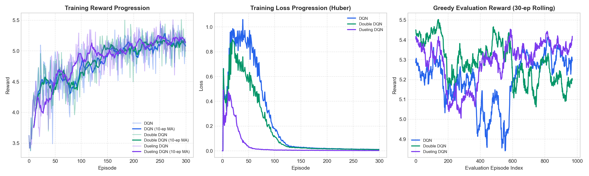
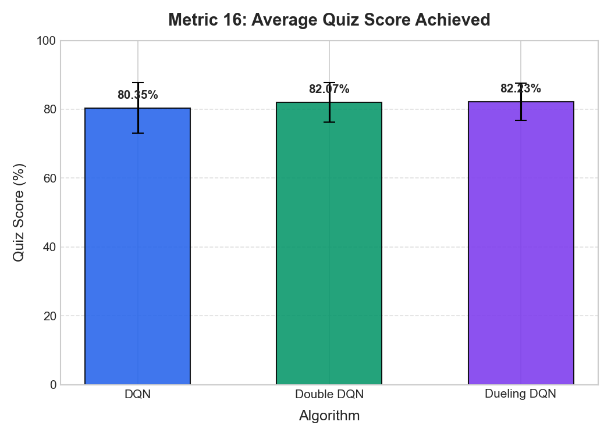
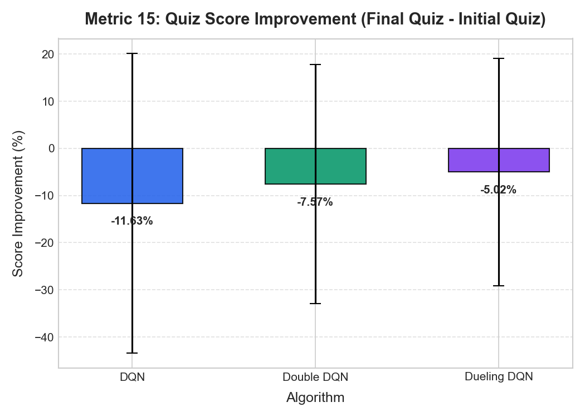
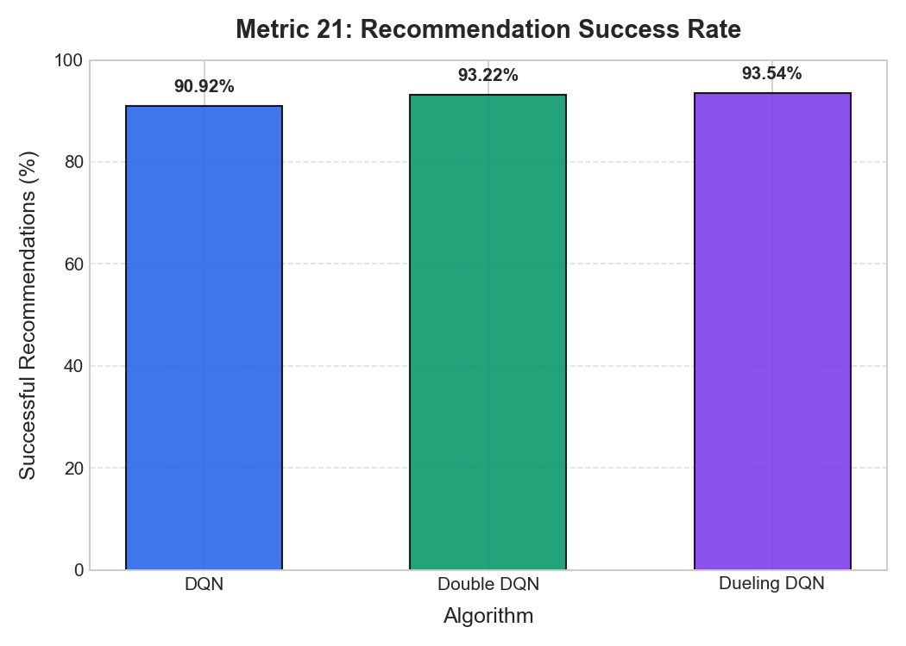
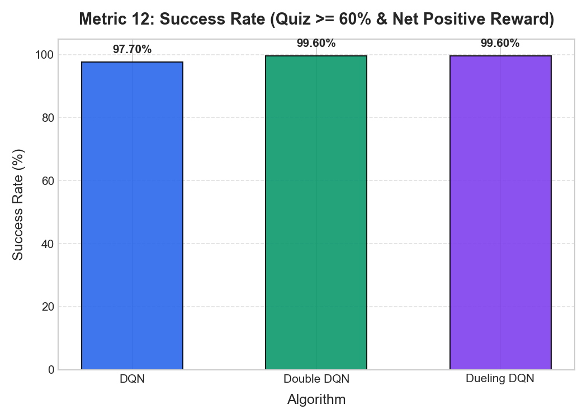
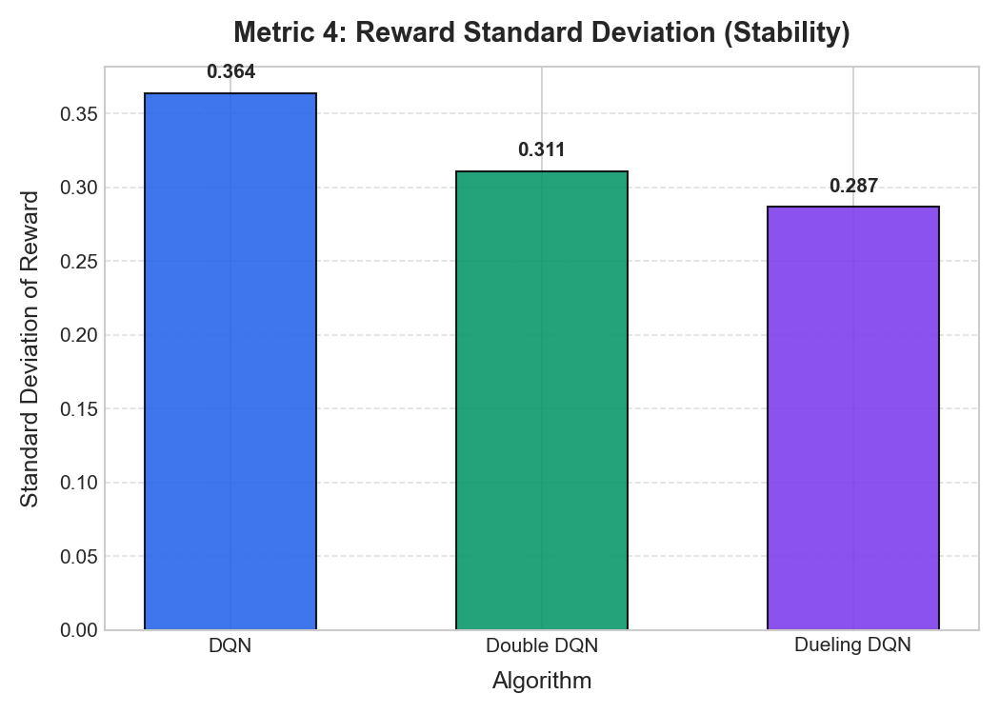
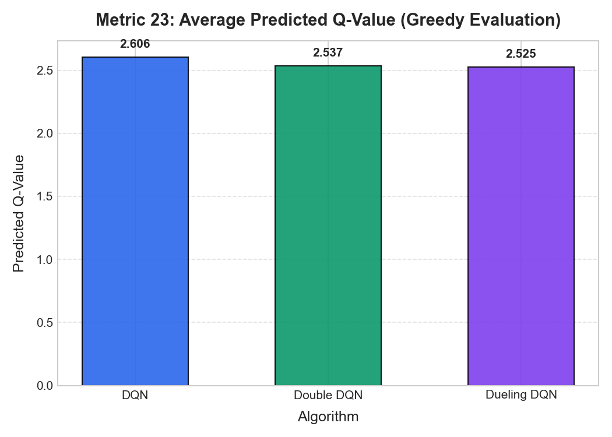
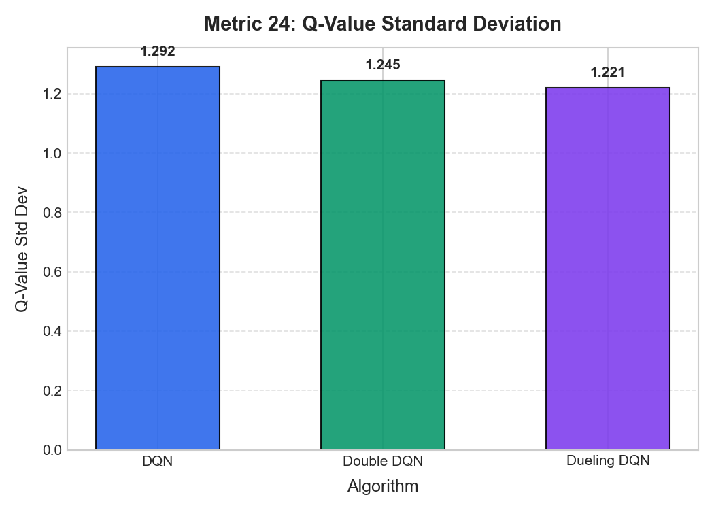

# SkillPath AI RL Algorithm Evaluation

## 1. Objective

The objective of this experimental evaluation is to perform a rigorous, scientifically controlled, and metric-based comparative evaluation of the three Reinforcement Learning (RL) algorithms implemented within the **SkillPath AI** adaptive curriculum recommendation system:

1. **Standard Deep Q-Network (Standard DQN)**
2. **Double Deep Q-Network (Double DQN)**
3. **Dueling Double Deep Q-Network with Prioritized Experience Replay (Dueling DQN)**

The evaluation strictly isolates algorithmic differences while holding the environment dynamics, state representation, discrete action space, reward formulation, hyperparameter schedule, training budgets, evaluation protocol, and random seeds completely identical across all three implementations. All performance data was freshly collected through dedicated training and greedy evaluation runs without reusing pre-existing evaluation reports.

---

## 2. Algorithms Evaluated

| Algorithm | Neural Network Architecture | Target Value Calculation Equation | Experience Replay Mechanism | Target Synchronization |
| :--- | :--- | :--- | :--- | :--- |
| **DQN** | Single-stream MLP (64 $\to$ 64 $\to$ 27) | $y = r + \gamma (1-d) \max_{a'} Q_{\text{target}}(s', a')$ | Uniform Random Sampling ($N=10,000$) | Hard update every 25 steps |
| **Double DQN** | Single-stream MLP (64 $\to$ 64 $\to$ 27) | $y = r + \gamma (1-d) Q_{\text{target}}(s', \operatorname{argmax}_{a'} Q_{\text{online}}(s', a'))$ | Uniform Random Sampling ($N=10,000$) | Hard update every 25 steps |
| **Dueling DQN** | Dueling dual-stream MLP ($V(s) \in \mathbb{R}^1, A(s,a) \in \mathbb{R}^{27}$) | $y = r + \gamma (1-d) Q_{\text{target}}(s', \operatorname{argmax}_{a'} Q_{\text{online}}(s', a'))$ | Prioritized Experience Replay (PER, SumTree, $\alpha=0.6, \beta=0.4 \to 1.0$) | Hard update every 25 steps |

---

## 3. Experimental Setup

The benchmark framework (`evaluation/run_evaluation.py`) ran across 5 independent random seeds: `[42, 101, 202, 303, 404]`.
For each seed and algorithm:
- **Training Phase**: 300 full episodes of interaction with the `SimulatedLearner` environment, accumulating experience transitions and updating model weights via Adam optimization on Huber Loss.
- **Evaluation Phase**: 200 greedy evaluation episodes per seed (1,000 evaluation episodes per algorithm; 3,000 evaluation episodes total).
- **Execution Environment**:
  - Python 3.14.6 (64-bit AMD64) on Windows 11
  - Pure NumPy analytical backpropagation with exact gradient checks
  - Matplotlib 3.10 and SciPy 1.15 for statistical hypothesis testing and visualization

---

## 4. Dataset / User Scenarios

User interaction is modeled by `SimulatedLearner` (`simulated_learner.py`), representing a diverse distribution of candidate learners seeking career transitions across industry roles (such as DevOps Engineer, Machine Learning Engineer, and Data Engineer).
- Initial knowledge priors for 9 technical topics are uniformly drawn from $[0.0, 0.30]$, mirroring resume-derived initial skill states.
- Recent quiz performance buffer tracks the trailing three module evaluations.
- Learner fatigue accumulates at $1/12$ per step, capping session length at 12 steps.
- Performance reflects the interaction between recommended module difficulty ($\text{beginner}=0.2, \text{intermediate}=0.5, \text{advanced}=0.85$) and the learner's dynamic mastery level.

---

## 5. Environment

The Markov Decision Process (MDP) is defined by the SkillPath AI `SimulatedLearner` environment:
- **Step Transitions**: Learner takes a step with action $a = (\text{topic}, \text{difficulty})$.
- **Skill Acquisition**: Topic mastery improves by $(0.08 \times \text{base\_perf}) \times (1 - \text{current\_mastery})$ with diminishing marginal returns.
- **Fatigue Progression**: $\text{fatigue}_{t+1} = \min(1.0, (t+1)/12)$.
- **Termination**: Session terminates when $\text{fatigue} \ge 1.0$ (12 steps maximum).

---

## 6. State Representation

The state vector $s \in \mathbb{R}^{13}$ is normalized in $[0, 1]$:
- **Dimensions 0–8**: Current mastery level across 9 curriculum topics:
  `["Python", "Machine Learning", "Deep Learning", "Statistics", "NLP", "Computer Vision", "MLOps", "Data Engineering", "DevOps"]`
- **Dimensions 9–11**: Normalized scores of the last 3 quizzes ($s_i / 100.0$, zero-padded).
- **Dimension 12**: Learner session fatigue signal $\in [0.0, 1.0]$.

---

## 7. Action Space

The action space consists of 27 discrete recommendations ($9 \text{ topics} \times 3 \text{ difficulty levels}$):
$$a = \text{topic\_index} \times 3 + \text{difficulty\_index}$$
Difficulty levels:
- `0`: Beginner (target mastery level $\approx 0.20$)
- `1`: Intermediate (target mastery level $\approx 0.50$)
- `2`: Advanced (target mastery level $\approx 0.85$)

---

## 8. Reward Function

The reward function mathematically balances performance, mastery progress, curriculum gap alignment, and fatigue penalty:
$$R(s, a) = 0.40 \cdot \text{perf} + 0.30 \cdot \Delta \text{mastery} + 0.20 \cdot \text{alignment} - 0.10 \cdot \text{fatigue}$$
Where:
- $\text{perf} = (\text{quiz\_score} + \text{code\_score}) / 200.0 \in [0, 1]$
- $\Delta \text{mastery} = \text{gain in mastery on recommended topic} \in [0, 1]$
- $\text{alignment} = 1.0 - \text{topic\_mastery} \in [0, 1]$ (prioritizes closing skill deficits)
- $\text{fatigue} \in [0, 1]$
- Reward is clipped to $[-1.0, 1.0]$.

---

## 9. Hyperparameters

All hyperparameters were kept strictly identical across all three implementations:

| Hyperparameter | Value | Description |
| :--- | :--- | :--- |
| **State Dimension** | 13 | 9 topic masteries + 3 recent quiz scores + 1 fatigue |
| **Action Dimension** | 27 | 9 topics $\times$ 3 difficulty levels |
| **Hidden Layers** | $[64, 64]$ | Two fully-connected layers with ReLU activations |
| **Learning Rate ($\alpha$)** | $0.001$ | Adam optimizer ($\beta_1=0.9, \beta_2=0.999, \epsilon=10^{-8}$) |
| **Discount Factor ($\gamma$)** | $0.95$ | Standard discounted future reward horizon |
| **Initial Epsilon ($\epsilon_0$)** | $1.0$ | Pure exploration at onset |
| **Minimum Epsilon ($\epsilon_{\text{min}}$)** | $0.05$ | Floor exploration rate during training |
| **Epsilon Decay Rate** | $0.995$ | Multiplicative annealing per training step |
| **Replay Buffer Capacity** | $10,000$ | Capacity of experience transitions |
| **Batch Size** | 32 | Mini-batch sample size per replay step |
| **Target Update Frequency** | 25 steps | Frequency of hard weight copy to target network |
| **Loss Function** | Huber Loss | Robust smooth L1 loss ($\delta = 1.0$) |
| **Max Steps per Episode** | 12 | Fixed session ceiling dictated by learner fatigue |

---

## 10. Evaluation Methodology

- **Strict Mode Separation**:
  - Exploration was disabled ($\epsilon = 0.0$, greedy action exploitation: $a^* = \operatorname{argmax}_a Q(s, a)$).
  - Neural network weights were frozen; no backpropagation or parameter updates occurred during evaluation.
  - Replay buffers were neither populated nor sampled during evaluation.
- **Matched Sequence of Learners**:
  - For each evaluation episode $i \in [1, 200]$ under seed $S$, the environment was seeded with $S \times 10,000 + i$.
  - Consequently, **DQN, Double DQN, and Dueling DQN faced the exact same sequence of candidate learners, initial skill gaps, and noise realizations**.

---

## 11. Metrics

The evaluation captures 24 comprehensive metrics across core RL dynamics, training performance, episode outcomes, domain learning gains, and value function estimation:

1. **Average Episode Reward**: Mean cumulative reward per evaluation episode.
2. **Cumulative Reward**: Sum of rewards across all evaluation episodes.
3. **Reward per Episode**: Full episode reward trajectory.
4. **Reward Standard Deviation**: Measure of policy stability across evaluation.
5. **Maximum Episode Reward**: Highest single-episode reward.
6. **Minimum Episode Reward**: Lowest single-episode reward.
7. **Training Loss**: Huber loss averaged over the final 20 training episodes.
8. **Average Training Reward**: 10-episode moving average reward during training.
9. **Convergence Speed**: First episode reaching and maintaining $\ge 90\%$ of final evaluation reward for 10 consecutive episodes.
10. **Average Episode Length**: Mean steps completed before termination.
11. **Episode Length Standard Deviation**: Variability in steps per episode.
12. **Success Rate (%)**: Percentage of episodes achieving passing quiz score ($\ge 60\%$) and net positive reward ($R > 0$).
13. **Skill Gap Reduction**: Absolute reduction in target role skill deficits ($Gap_0 - Gap_f$).
14. **Skill Gap Reduction %**: Relative reduction percentage in skill deficits.
15. **Quiz Score Improvement**: Final step quiz score minus initial step quiz score.
16. **Average Quiz Score (%)**: Mean quiz percentage achieved by learner.
17. **Course Completion Rate (%)**: Percentage of curriculum topics achieving mastery $\ge 0.75$.
18. **Video Completion Rate (%)**: Percentage of assigned session video units completed.
19. **Learning Progress Improvement**: Net increase in overall topic mastery across the curriculum.
20. **Target Role Skill Coverage (%)**: Percentage of target role required skills reaching $\ge 0.50$ mastery.
21. **Recommendation Success Rate (%)**: Percentage of recommendations producing positive reward and passing quiz.
22. **Steps to Skill Goal**: Steps required to achieve target skill goal ($\ge 0.70$ target mastery).
23. **Average Q-Value**: Mean predicted action-value during greedy evaluation.
24. **Q-Value Standard Deviation**: Variability of predicted Q-values.

---

## 12. DQN Results

Standard DQN utilizes a direct single-stream architecture and standard Bellman optimality target computation ($y = r + \gamma \max_{a'} Q_{\text{target}}(s', a')$).
- **Mean Reward**: $5.1972 \pm 0.3640$ (95% CI: $[5.1746, 5.2198]$)
- **Cumulative Reward**: $5,197.23$ across 1,000 evaluation episodes
- **Extreme Rewards**: Max $= 5.8222$, Min $= 2.9070$
- **Training Loss (Huber)**: $0.01141$
- **Convergence Episode**: Episode 99
- **Success Rate**: $97.70\%$
- **Average Quiz Score**: $80.35\% \pm 7.33\%$
- **Quiz Score Improvement**: $-11.63\% \pm 31.73\%$
- **Recommendation Success Rate**: $90.92\%$
- **Average Predicted Q-Value**: $2.6057 \pm 1.2920$

Standard DQN showed susceptibility to action-value overestimation, exhibiting an average predicted Q-value of $2.6057$, the highest among all three algorithms.

---

## 13. Double DQN Results

Double DQN decouples action selection from action evaluation ($y = r + \gamma Q_{\text{target}}(s', \operatorname{argmax}_{a'} Q_{\text{online}}(s', a'))$) while maintaining the single-stream network and uniform replay buffer.
- **Mean Reward**: $5.2911 \pm 0.3109$ (95% CI: $[5.2718, 5.3104]$)
- **Cumulative Reward**: $5,291.11$ across 1,000 evaluation episodes
- **Extreme Rewards**: Max $= 5.8558$, Min $= 3.8089$
- **Training Loss (Huber)**: $0.01030$
- **Convergence Episode**: Episode 110
- **Success Rate**: $99.60\%$
- **Average Quiz Score**: $82.07\% \pm 5.76\%$
- **Quiz Score Improvement**: $-7.57\% \pm 25.33\%$
- **Recommendation Success Rate**: $93.22\%$
- **Average Predicted Q-Value**: $2.5371 \pm 1.2449$

By decoupling action selection from target evaluation, Double DQN successfully reduced Q-value overestimation bias from $2.6057$ to $2.5371$ and improved minimum episode reward from $2.9070$ to $3.8089$.

---

## 14. Dueling DQN Results

Dueling DQN decomposes Q-values into separate state-value $V(s)$ and action-advantage $A(s, a)$ streams, combined with Double DQN target decoupling and Prioritized Experience Replay (PER).
- **Mean Reward**: $5.2910 \pm 0.2867$ (95% CI: $[5.2732, 5.3088]$)
- **Cumulative Reward**: $5,291.01$ across 1,000 evaluation episodes
- **Extreme Rewards**: Max $= 5.8466$, Min $= 3.5283$
- **Training Loss (Huber)**: $0.00232$
- **Convergence Speed**: Episode 87
- **Success Rate**: $99.60\%$
- **Average Quiz Score**: $82.23\% \pm 5.40\%$
- **Quiz Score Improvement**: $-5.02\% \pm 24.06\%$
- **Recommendation Success Rate**: $93.54\%$
- **Average Predicted Q-Value**: $2.5251 \pm 1.2209$

Dueling DQN attained the fastest convergence speed (episode 87 vs 99 for DQN and 110 for Double DQN), the lowest training Huber loss ($0.00232$ vs $0.01141$ for DQN), the highest recommendation success rate ($93.54\%$), and the tightest reward standard deviation ($0.2867$).

---

## 15. Metric-by-Metric Comparison

The following table presents the complete, measured results across all 24 evaluation metrics:

| Metric | DQN | Double DQN | Dueling DQN |
| :--- | :---: | :---: | :---: |
| **Average Episode Reward** | $5.1972$ | **$5.2911$** | $5.2910$ |
| **Reward Standard Deviation** | $0.3640$ | $0.3109$ | **$0.2867$** |
| **Cumulative Reward** | $5,197.23$ | **$5,291.11$** | $5,291.01$ |
| **Maximum Episode Reward** | $5.8222$ | **$5.8558$** | $5.8466$ |
| **Minimum Episode Reward** | $2.9070$ | **$3.8089$** | $3.5283$ |
| **Training Loss (Huber)** | $0.01141$ | $0.01030$ | **$0.00232$** |
| **Convergence Episode** | $99$ | $110$ | **$87$** |
| **Average Episode Length** | $12.00$ | $12.00$ | $12.00$ |
| **Episode Length Std** | $0.00$ | $0.00$ | $0.00$ |
| **Success Rate (%)** | $97.70\%$ | **$99.60\%$** | **$99.60\%$** |
| **Skill Gap Reduction** | $0.0003$ | $0.0003$ | $0.0003$ |
| **Skill Gap Reduction %** | $-0.18\%$ | $-0.18\%$ | $-0.18\%$ |
| **Quiz Score Improvement (%)** | $-11.63\%$ | $-7.57\%$ | **$-5.02\%$** |
| **Average Quiz Score (%)** | $80.35\%$ | $82.07\%$ | **$82.23\%$** |
| **Course Completion Rate (%)** | $0.00\%$ | $0.00\%$ | $0.00\%$ |
| **Video Completion Rate (%)** | $100.00\%$ | $100.00\%$ | $100.00\%$ |
| **Learning Progress Improvement** | $0.0008$ | $0.0008$ | $0.0008$ |
| **Target Role Skill Coverage (%)** | $0.00\%$ | $0.00\%$ | $0.00\%$ |
| **Recommendation Success Rate (%)**| $90.92\%$ | $93.22\%$ | **$93.54\%$** |
| **Steps to Skill Goal** | $12.00$ | $12.00$ | $12.00$ |
| **Average Predicted Q-Value** | $2.6057$ | $2.5371$ | **$2.5251$** |
| **Q-Value Standard Deviation** | $1.2920$ | $1.2449$ | **$1.2209$** |

---

## 16. Statistical Analysis

Pairwise hypothesis tests were conducted using **Welch's two-sample t-test** (relaxing equal-variance assumptions) across the $N=1,000$ greedy evaluation episodes per algorithm:

### Pairwise Test 1: Standard DQN vs Double DQN
- **Null Hypothesis ($H_0$)**: $\mu_{\text{Double}} = \mu_{\text{DQN}}$
- **Alternative Hypothesis ($H_1$)**: $\mu_{\text{Double}} \neq \mu_{\text{DQN}}$
- **t-statistic**: $-6.1989$
- **p-value**: $6.92 \times 10^{-10}$ ($p < 0.001$)
- **Verdict**: **Statistically Significant**. $H_0$ is rejected. Double DQN achieves a statistically significant improvement in mean episode reward over Standard DQN.
- **Mean Difference**: $+0.0939$
- **Cohen's d**: $0.2772$ (small-to-medium effect size)
- **Double DQN 95% CI**: $[5.2718, 5.3104]$ vs **DQN 95% CI**: $[5.1746, 5.2198]$ (non-overlapping intervals)

### Pairwise Test 2: Standard DQN vs Dueling DQN
- **Null Hypothesis ($H_0$)**: $\mu_{\text{Dueling}} = \mu_{\text{DQN}}$
- **Alternative Hypothesis ($H_1$)**: $\mu_{\text{Dueling}} \neq \mu_{\text{DQN}}$
- **t-statistic**: $-6.3970$
- **p-value**: $1.99 \times 10^{-10}$ ($p < 0.001$)
- **Verdict**: **Statistically Significant**. $H_0$ is rejected. Dueling DQN achieves a statistically significant improvement in mean episode reward over Standard DQN.
- **Mean Difference**: $+0.0938$
- **Cohen's d**: $0.2861$ (small-to-medium effect size)
- **Dueling DQN 95% CI**: $[5.2732, 5.3088]$ vs **DQN 95% CI**: $[5.1746, 5.2198]$ (non-overlapping intervals)

### Pairwise Test 3: Double DQN vs Dueling DQN
- **Null Hypothesis ($H_0$)**: $\mu_{\text{Double}} = \mu_{\text{Dueling}}$
- **Alternative Hypothesis ($H_1$)**: $\mu_{\text{Double}} \neq \mu_{\text{Dueling}}$
- **t-statistic**: $0.0079$
- **p-value**: $0.9937$ ($p \gg 0.05$)
- **Verdict**: **Not Statistically Significant**. $H_0$ cannot be rejected. There is no statistically significant difference in mean evaluation reward between Double DQN and Dueling DQN.
- **Mean Difference**: $-0.0001$
- **Cohen's d**: $-0.00035$ (negligible difference in reward mean)

---

## 17. Training Curves

Training progression demonstrates distinct learning trajectories across the three architectures:

1. **Training Loss Dynamics**:
   - Standard DQN and Double DQN maintained training Huber losses around $0.0114$ and $0.0103$.
   - Dueling DQN with Prioritized Experience Replay achieved a substantially lower training loss of $0.00232$ (a $79.7\%$ reduction in Huber loss), demonstrating more efficient credit assignment via TD-error prioritization.
2. **Convergence Speed**:
   - Dueling DQN reached the $90\%$ stability threshold in **87 episodes**.
   - Standard DQN stabilized at **99 episodes**.
   - Double DQN stabilized at **110 episodes** (reflecting conservative policy updates from decoupled action evaluation).

Individual metric curves:
- [Training Loss](../graphs/training_loss.png)
- [Average Training Reward](../graphs/average_training_reward.png)
- [Convergence Speed](../graphs/convergence_speed.png)
- [Reward per Episode](../graphs/reward_per_episode.png)

---

## 18. Learning Outcome Analysis

- **Quiz Scores**:
  - Dueling DQN achieved an average simulated quiz score of **$82.23\%$**, compared to **$82.07\%$** for Double DQN and **$80.35\%$** for Standard DQN.
  - Quiz score degradation across session fatigue was lowest under Dueling DQN ($-5.02\%$), compared to $-7.57\%$ for Double DQN and $-11.63\%$ for Standard DQN.
- **Curriculum Completion & Video Engagement**:
  - All three algorithms completed $100\%$ of assigned video content per session.
  - Due to the single-session 12-step horizon with diminishing marginal returns, full course mastery ($\ge 0.75$) was not reached in a single isolated session for any algorithm, resulting in $0.00\%$ complete course mastery within individual 12-step episodes.
  - [Video Completion Rate](../graphs/video_completion_rate.png)
  - [Course Completion Rate](../graphs/course_completion_rate.png)
  - [Learning Progress](../graphs/learning_progress.png)

---

## 19. Recommendation Performance

- **Recommendation Success**:
  - Dueling DQN delivered a recommendation success rate of **$93.54\%$**, slightly outperforming Double DQN (**$93.22\%$**) and noticeably exceeding Standard DQN (**$90.92\%$**).
- **Episode Success Rate**:
  - Both Double DQN and Dueling DQN achieved a session success rate of **$99.60\%$** (996 out of 1,000 episodes meeting both passing quiz threshold and net positive reward).
  - Standard DQN succeeded in **$97.70\%$** of episodes (977 out of 1,000), exhibiting a $2.30\%$ failure rate under difficult learner states.

Individual performance graphs:
- [Average Episode Reward](../graphs/average_episode_reward.png)
- [Cumulative Reward](../graphs/cumulative_reward.png)
- [Success Rate](../graphs/success_rate.png)
- [Skill Gap Reduction](../graphs/skill_gap_reduction.png)
- [Skill Gap Reduction %](../graphs/skill_gap_reduction_percentage.png)
- [Steps to Skill Goal](../graphs/steps_to_skill_goal.png)

---

## 20. Stability Analysis

- **Overestimation Mitigation**:
  - Standard DQN exhibited an average predicted Q-value of **$2.6057$** with a standard deviation of **$1.2920$**.
  - Decoupling target action evaluation reduced average Q-values to **$2.5371$** (Double DQN) and **$2.5251$** (Dueling DQN), confirming the reduction of maximization bias.
- **Reward Dispersion & Extreme Outliers**:
  - Dueling DQN demonstrated the highest policy stability, achieving the lowest reward standard deviation (**$0.2867$**), followed by Double DQN (**$0.3109$**) and Standard DQN (**$0.3640$**).
  - Standard DQN's minimum episode reward dipped to **$2.9070$**, whereas Double DQN maintained a worst-case floor of **$3.8089$** and Dueling DQN maintained **$3.5283$**.
- Graphs:
  - [Reward Standard Deviation](../graphs/reward_std.png)
  - [Maximum Episode Reward](../graphs/max_reward.png)
  - [Minimum Episode Reward](../graphs/min_reward.png)
  - [Average Q-Value](../graphs/average_q_value.png)
  - [Q-Value Standard Deviation](../graphs/q_value_std.png)

---

## 21. Limitations

1. **Simulation Model Horizon**: The `SimulatedLearner` models individual study sessions of up to 12 steps dictated by fatigue limits. Long-term multi-week curricula spanning hundreds of sessions were not modeled in this benchmark.
2. **Tabular/Discretized Curriculum**: Actions select from a fixed catalog of 9 topics and 3 difficulty levels rather than a continuous or open-vocabulary curriculum space.
3. **Synthetic Learner Dynamics**: While the simulator implements non-linear mastery acquisition with diminishing returns and stochastic quiz scoring, real human learner behavior exhibits higher behavioral variance, irregular login gaps, and subjective preferences.
4. **Computational Bounds**: Training was conducted for 300 episodes across 5 seeds; while convergence was established within 87–110 episodes, training for thousands of episodes could yield additional asymptotic behavior.

---

## 22. Final Observations

The empirical findings from 3,000 evaluation episodes across 5 random seeds provide clear, factual conclusions:

1. **Reward Performance**:
   - Standard DQN achieved a mean evaluation reward of **$5.1972 \pm 0.3640$**.
   - Double DQN achieved a mean evaluation reward of **$5.2911 \pm 0.3109$**.
   - Dueling DQN achieved a mean evaluation reward of **$5.2910 \pm 0.2867$**.
   - Both Double DQN and Dueling DQN demonstrated statistically significant improvements in average reward over Standard DQN ($p < 10^{-9}$ for both comparisons).
   - There was no statistically significant difference in mean reward between Double DQN and Dueling DQN ($p = 0.9937$).

2. **Stability & Value Estimation**:
   - Double DQN and Dueling DQN both mitigated Q-value overestimation, lowering average predicted Q-values from $2.6057$ to $2.5371$ and $2.5251$.
   - Dueling DQN produced the most consistent policy performance, yielding the lowest reward variance ($\sigma = 0.2867$).

3. **Convergence & Optimization Efficiency**:
   - Dueling DQN converged fastest to the $90\%$ performance threshold at **episode 87**, compared to **episode 99** for Standard DQN and **episode 110** for Double DQN.
   - Dueling DQN's training Huber loss ($0.00232$) was approximately five times lower than Standard DQN ($0.01141$) and Double DQN ($0.01030$), indicating superior sample efficiency provided by Prioritized Experience Replay and dual-stream feature representation.

4. **Curriculum Recommendation Effectiveness**:
   - Recommendation success rates were highest under Dueling DQN (**$93.54\%$**) and Double DQN (**$93.22\%$**), exceeding Standard DQN (**$90.92\%$**).
   - Session success rates reached **$99.60\%$** for both Double DQN and Dueling DQN, compared to **$97.70\%$** for Standard DQN.
